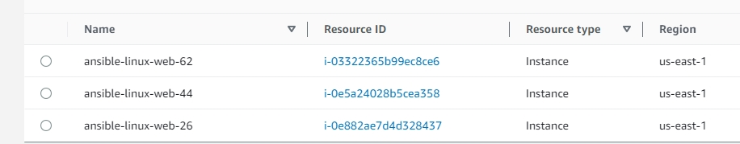

# Ansible-Zero-to-Prod
Ansible-Zero-to-Prod from Educative.io


## Ansible with AWS

```bash
# replace <Access Key> with your access key Id
export AWS_ACCESS_KEY_ID=`cat .aws/credentials | grep default -A 2 | grep aws_access_key_id | awk '{print $3}'`

# replace <Secret Access Key> with your secret access key
export AWS_SECRET_ACCESS_KEY=`cat .aws/credentials | grep default -A 2 | grep aws_secret_access_key | awk '{print $3}'`
```


### Create AWS caller information
You can verify that connection to AWS is established by gathering the caller information using the Ansible module aws_caller_info.

Run the following command in the Ansible environment:

```bash
ansible localhost -m aws_caller_info
```

Use Ansible to get AWS caller information
Running the aws_caller_info again will return the JSON object back.

Practice all the commands one by one in the Ansible environment. We can skip the first two commands by setting the environment variables in the terminal. You can find the summarized view of all the commands below:

```bash
# replace <Access Key> with your access key Id
export AWS_ACCESS_KEY_ID=`cat .aws/credentials | grep rustyboc -A 2 | grep aws_access_key_id | awk '{print $3}'`

# replace <Secret Access Key> with your secret access key
export AWS_SECRET_ACCESS_KEY=`cat .aws/credentials | grep rustyboc -A 2 | grep aws_secret_access_key | awk '{print $3}'`

# Verify that the connection to AWS is established
ansible -vvv localhost -m aws_caller_info

# In case of error, 
# "_Failed to import the required Python library (botocore or boto3)"
pip3 install boto3
pip3 install boto

# re-execute
ansible localhost -m aws_caller_info
```

## Ansible with Azure


```bash
az --version
az login
```

```powershell

# Replace the <ServicePrincipalName> with a name of your own choice
az ad sp create-for-rbac --name ServicePrincipleAnsible


# Replace the APP_ID with the output appId of the create-for-rbac command. 
az role assignment create --assignee appID --role Contributor

# Replace the APP_ID with the output appId of the create-for-rbac command. 
az role assignment list --assignee appID


```


### Getting Azure information

```bash
# Azure Subscription Id
 subscriptionid=$(az account show --query id --output tsv)

# Azure Client Id
# Replace <appId> with the actual App Id
clientid=<appId>

# Azure Secret. 
# Replace <Password> with the auto-generated password for service principal.
secret=<password>

# Azure Tenant Id
# Replace <tenant> with the actual tenant Id
tenantid=<tenant>

export AZURE_SUBSCRIPTION_ID=$subscriptionid; 
export AZURE_CLIENT_ID=$clientid;
export AZURE_SECRET=$secret;
export AZURE_TENANT=$tenantid;

# echo variables and save them for later use.
echo $AZURE_SUBSCRIPTION_ID
echo $AZURE_CLIENT_ID
echo $AZURE_SECRET
echo $AZURE_TENANT
```

#### Check Ansible Azure module is installed.

> CAUTION
>> This may break existing Ansible or/and Azure CLI installations

```bash
pip3 install ansible[azure]
```

### Run Ansible for Azure

```bash
ansible localhost -m azure_rm_resourcegroup -a "name=ansible location=eastus"

#Ansible 2.9 with azure_rm module
ansible localhost -m azure_rm_resourcegroup -a "name=ansible-test location=eastus"

#Ansible 2.10 with azure.azcollection
ansible localhost -m azure.azcollection.azure_rm_resourcegroup -a "name=<resource_group_name> location=<location>"
```


## Connect to instance

```bash
in10c2 ➜ ~/IN10C2/github/Ansible-Zero-to-Prod (main ✗) $ ansible all -i  xx.xxx.xx.xxx, -m ping -e "ansible_user=ansible ansible_password=Iamroot0 ansible_ssh_common_args='-o StrictHostKeyChecking=no'"
20.51.164.72 | SUCCESS => {
    "ansible_facts": {
        "discovered_interpreter_python": "/usr/libexec/platform-python"
    },
    "changed": false,
    "ping": "pong"
}
```


### Windows connection modules

```bash
# Replace the <Public Ip Address> with the actual
# Linux Instance or VM IP Address
ansible all -i <Public Ip Address>, -m ping

# Disable Host Key Checking
# Replace the <Public Ip Address> with the actual 
# Linux instance or VM IP Address
ansible all -i <Public Ip Address>, -m ping -e "ansible_ssh_common_args='-o StrictHostKeyChecking=no'"

# Replace the <Public Ip Address> with the actual 
# Linux instance or VM IP Address and 
# <Password> with your actual password
ansible all -i <Public Ip Address>, -m ping -e "ansible_user=ansible ansible_password=<Password> ansible_ssh_common_args='-o StrictHostKeyChecking=no'"

# Replace <Password> with your Actual Password
# Replace <Public IP Address> with Windows Host IP Address
ansible all -i <Public IP Address>, -m win_ping -e "ansible_user=ansible ansible_password=<Password> ansible_winrm_server_cert_validation=ignore ansible_connection=winrm"
```


## Automated AWS instance spin up

Run the below playbooks to spin up upto 100 VMS:

```bash
# Supply a random number when prompted
ansible-playbook aws_create_vpc.yaml

# Supply a pssword and the same random number as above
ansible-playbook aws_create_linux_ec2_instance.yaml
```


### Checkout these babies




